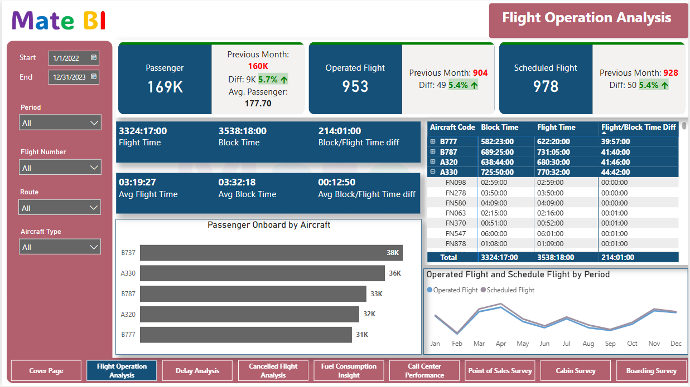
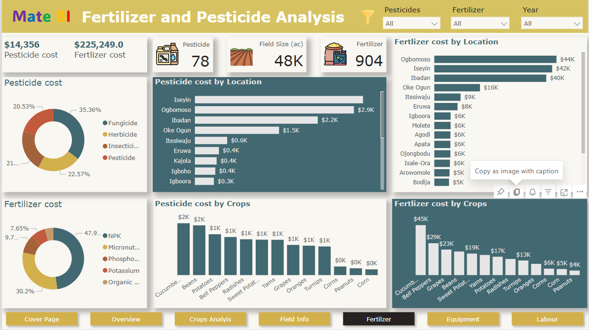
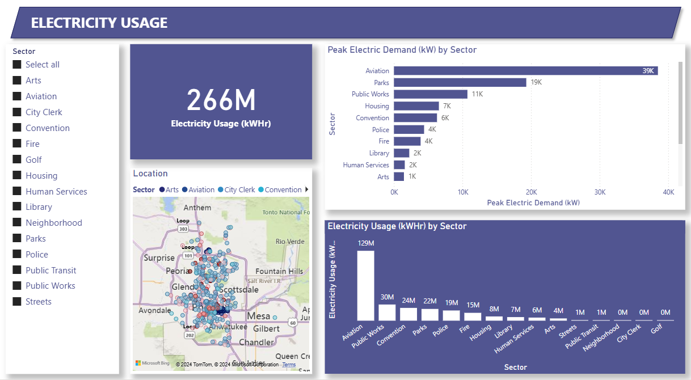

## ABOUT ME

Hi! I'm Seun Mate 🙂, A results-driven data analyst with a strong foundation in Pure and Applied Mathematics with experience in helping industries; such as Manufacturing, Agriculture, Aviation, and Oil & Gas among others, to make an informed decision about their data.

## WHAT I DO

*As a Data Analyst Consultant at Wragby Business Solutions, I oversee report creation for stakeholders across industries, train users on Power BI, manage management staff attendance using Power BI, and render support to industries related to Business intelligence.*

## MY PORTFOLIO

*A snapshot of some projects I worked on.*

**Airline Operation Report**

This is a eight(8) page report that enables stakeholders to track and analyze key performance indicators (KPIs) across different areas of airline operations, supporting data-driven decisions that align with organizational objectives.

[Read More]()

[Explore Report](https://app.powerbi.com/view?r=eyJrIjoiOWQ3MTI3M2YtNDMwNy00OWM1LTk4NDItYWQxMTYxNDU5ODAzIiwidCI6IjcwODU3MjViLWYwMWQtNGQwMi1hZDFjLWIxYThhNmY0NDEwNiIsImMiOjh9)

**Farming Analytics**

This is a six(6) page report that provides end users with actionable insights into crop performance, resource utilization, and workforce efficiency, empowering data-driven decisions to enhance productivity and profitability.

[Read More]()

[Explore Report](https://app.powerbi.com/view?r=eyJrIjoiYmQ3MDg4N2EtMWNkZS00ODMzLThlMjktNjc3YWJiYzI4ZTlmIiwidCI6IjcwODU3MjViLWYwMWQtNGQwMi1hZDFjLWIxYThhNmY0NDEwNiIsImMiOjh9)

**Energy Consumption Report**

The report provides an analysis of energy consumption, focusing on two primary types: natural gas and electricity. It highlights energy usage across various sectors, enabling users to identify consumption patterns and trends. This insight will assist organizations in optimizing energy allocation to different sectors based on their specific demands, ensuring efficiency and meeting sectoral energy needs effectively.

[Explore Report](https://app.powerbi.com/view?r=eyJrIjoiYzVlNzdjMWYtZTNiNC00MThmLTk0NDAtOTc2MDZmMGE0MTRmIiwidCI6IjcwODU3MjViLWYwMWQtNGQwMi1hZDFjLWIxYThhNmY0NDEwNiIsImMiOjh9)
