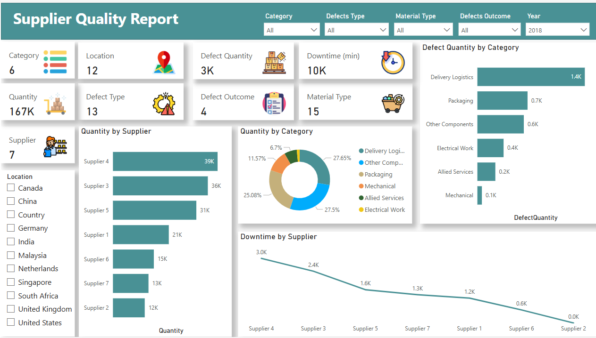
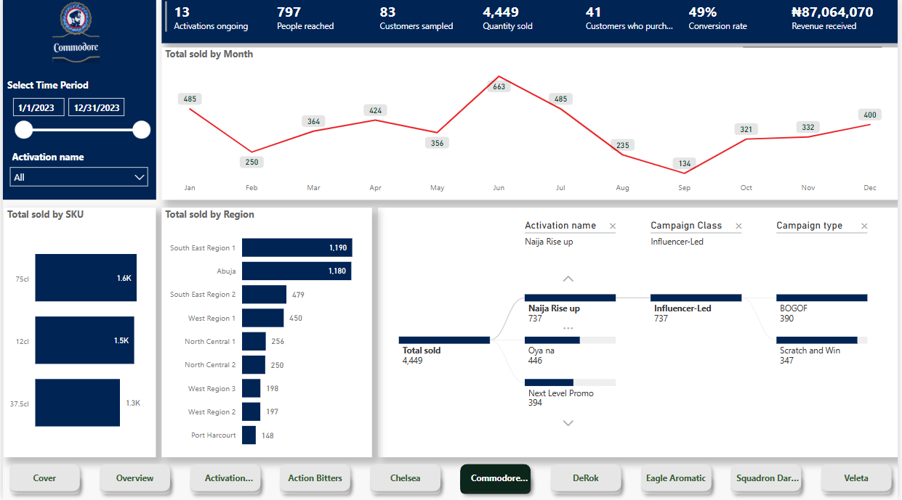
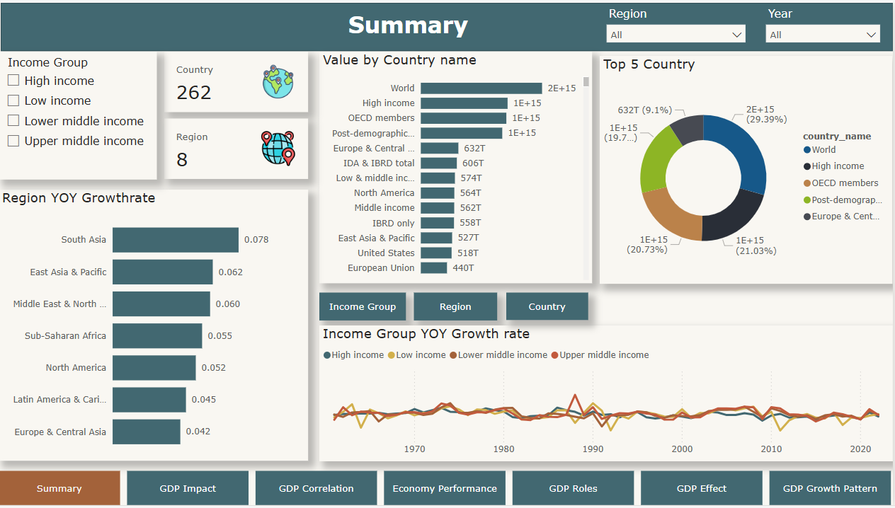

## ABOUT ME

Hi! I'm Seun Mate 🙂, A results-driven data analyst with a strong foundation in Pure and Applied Mathematics with experience in helping industries; such as Manufacturing, Agriculture, Aviation, and Oil & Gas among others, to make an informed decision about their data.

## WHAT I DO

*As a Data Analyst Consultant at Wragby Business Solutions, I oversee report creation for stakeholders across industries, train users on Power BI, manage management staff attendance using Power BI, and render support to industries related to Business intelligence.*

## MY PORTFOLIO

*A snapshot of some projects I worked on.*

**Supplier Quality Report**

The Supplier Quality Report analyzes the quality performance of different suppliers based on defect quantities, downtime, and overall production output. Key aspects covered in the report include:
Supplier Performance – Tracks the quantity supplied by each supplier and their corresponding defect rates.
Defect Analysis – Evaluates defect quantities across different categories (e.g., Delivery Logistics, Packaging, Electrical Work).
Downtime Impact – Measures downtime in minutes caused by defects, with a breakdown by supplier.
Category-wise Contribution – Shows the proportion of materials or services provided by different categories.
Geographic Analysis – Includes location-based filtering to analyze supplier quality performance across different regions.
Defect Outcomes & Material Type – Provides insights into the impact of defects and the types of materials associated with issues.
This report is useful for identifying high-performing suppliers, reducing defects, and improving supply chain efficiency.

[Explore Report](https://app.powerbi.com/view?r=eyJrIjoiZjUxM2MxMGEtODFjNi00ZDAwLThiZGItZTA3YWRhYzhmN2JlIiwidCI6IjcwODU3MjViLWYwMWQtNGQwMi1hZDFjLWIxYThhNmY0NDEwNiIsImMiOjh9)

**Airline Operation Report**

This report provides a comprehensive overview of airline operations, including passenger boarding patterns, comparisons of scheduled versus operated flights, flight delays and cancellations with their causes, and flight time metrics. It also evaluates call center performance, analyzing agent efficiency and call dispositions, while addressing customer concerns to assess overall service quality. These insights empower users to mitigate delays, reduce cancellations, and enhance operational efficiency.

[Explore Report](https://app.powerbi.com/view?r=eyJrIjoiOWQ3MTI3M2YtNDMwNy00OWM1LTk4NDItYWQxMTYxNDU5ODAzIiwidCI6IjcwODU3MjViLWYwMWQtNGQwMi1hZDFjLWIxYThhNmY0NDEwNiIsImMiOjh9)

**Market Campaign Report**

The Market Campaign Analytics Dashboard enables marketers to track campaign effectiveness, identify high-performing activations, and uncover areas for improvement. With its interactive design and real-time data updates, it is an essential tool for optimizing marketing strategies and maximizing campaign ROI.

[Explore Report](https://app.fabric.microsoft.com/view?r=eyJrIjoiOWNjMTIwMTctYWVjYy00NWMyLWI2OGItMzkzNmY0ZmY2YTc3IiwidCI6IjcwODU3MjViLWYwMWQtNGQwMi1hZDFjLWIxYThhNmY0NDEwNiIsImMiOjh9)

**GDP Analysis**

This report provides a comprehensive analysis of economic contributions across different income groups and countries. Key insights include; Income Group Contributions – The global economy is segmented into various income groups, highlighting disparities in economic output and contributions.
Top Economic Contributors – A handful of countries dominate global economic performance, with clear trends in GDP growth and stability.
Year-over-Year (YoY) Growth Trends – Economic growth rates fluctuate across regions, with emerging economies showing rapid expansion while developed economies exhibit steady but slower growth.
Global Economic Classifications – Countries are categorized based on economic performance, reflecting disparities in income levels, industrial output, and financial stability.
Key Takeaways – Strategic insights on economic power shifts, potential investment opportunities, and risks associated with income inequality.
This report serves as a valuable resource for decision-makers in finance, policy-making, and investment, providing a data-driven perspective on global economic trends.

[Explore Report](https://app.powerbi.com/view?r=eyJrIjoiNjhmMTk2MGMtZjljZi00YWQ3LTkzNTktNzZjZDc3NmM2ODVjIiwidCI6IjcwODU3MjViLWYwMWQtNGQwMi1hZDFjLWIxYThhNmY0NDEwNiIsImMiOjh9)

**Farming Analytics**

This report provides actionable insights by identifying the most profitable fields, crops, and locations, enabling better resource allocation and strategic planning. It helps optimize workforce deployment, equipment utilization, and budget management while guiding crop decisions based on sales, profit, and yield. Seasonal performance trends and cost breakdowns allow for effective planning and cost reduction. Additionally, the report offers a clear overview of business performance for stakeholders and tracks progress against key goals and KPIs.

[Explore Report](https://app.powerbi.com/view?r=eyJrIjoiYmQ3MDg4N2EtMWNkZS00ODMzLThlMjktNjc3YWJiYzI4ZTlmIiwidCI6IjcwODU3MjViLWYwMWQtNGQwMi1hZDFjLWIxYThhNmY0NDEwNiIsImMiOjh9)

**Energy Consumption Report**

The report provides an analysis of energy consumption, focusing on two primary types: natural gas and electricity. It highlights energy usage across various sectors, enabling users to identify consumption patterns and trends. This insight will assist organizations in optimizing energy allocation to different sectors based on their specific demands, ensuring efficiency and meeting sectoral energy needs effectively.

[Explore Report](https://app.powerbi.com/view?r=eyJrIjoiYzVlNzdjMWYtZTNiNC00MThmLTk0NDAtOTc2MDZmMGE0MTRmIiwidCI6IjcwODU3MjViLWYwMWQtNGQwMi1hZDFjLWIxYThhNmY0NDEwNiIsImMiOjh9)
